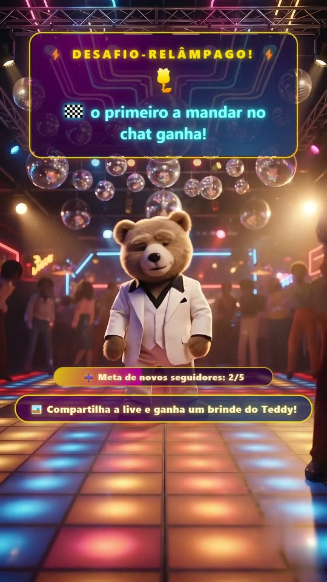

# 🐻🕺 Teddy Travolta Live

🇺🇸 English · **[🇧🇷 Português](README.pt-BR.md)**

**An interactive TikTok LIVE with an AI character that reacts to the audience in real time.**

<p align="center">
  
</p>
<!-- DEMO: animated GIF + more action shots coming soon (regenerated from the simulator) -->

A *Saturday Night Fever*-style teddy bear dances in a 70s disco and:

- 🔊 **Thanks gift senders by name**, with a Brazilian Portuguese voice (free TTS, no API key)
- 💬 **Answers chat comments out loud**, powered by a local LLM (Ollama)
- 🎬 **Switches OBS scenes on its own** — celebrates, chats, toasts at the bar, moonwalks
- ✨ **Animated overlay** with thank-you cards, live goals and audience challenges

> This repository ships **all the code**. The character's videos, music and images are
> **not distributed** — you create your own with AI tools by following the guide in
> [docs/creating-the-media.md](docs/creating-the-media.md). Take the method and build
> YOUR character!

---

## How it works

```
TikTok Live ──► tiktok.js ──► queue.js (priority queue) ──┬─► TTS + audio (Edge TTS)
   (events)                   gift > comment > share...    ├─► OBS (scene switching)
                                                           └─► Overlay (cards/goals)
```

Everything flows through a **sequential queue**: one thank-you at a time, audio never
overlaps, and the temporary scene only returns to the dance once the speech ends (the
character's mouth in the video moves along with the voice — the classic VTuber
talking illusion).

| Live event | Teddy's reaction |
|---|---|
| 🎁 Small gift (1–99 coins) | Short phrase + celebration scene |
| 🎁 Big gift (100+ coins) | **Sung jingle** + long phrase + pulsing golden card |
| 💬 Comment | Spoken reply generated by the local LLM (with automatic moderation) |
| ➕ Follow | Welcome to the crew, talking scene |
| 🔁 Share | Martini toast at the bar scene |
| ❤️ Like storm | Moonwalk |
| 👋 Viewer joins | Welcome greeting (with a configurable throttle) |
| 👥 Audience milestones | "We're already X on the dance floor!" |
| 😴 Nobody interacting | Teddy starts a conversation on his own (LLM) |
| 🎯 Live goal reached | Celebration + progress bar on the overlay |
| ⚡ Flash challenge | "First to type 🌹 in chat gets a shout-out!" — and the winner really gets one |

## Stack

- **Node.js 18+** (ESM) · [tiktok-live-connector](https://github.com/zerodytrash/TikTok-Live-Connector) (live events)
- **msedge-tts** — free Brazilian Portuguese voice (Edge TTS, no API key)
- **obs-websocket-js v5** — OBS control · **express + ws** — overlay
- **ffmpeg/ffplay** — audio playback and video post-production
- **Ollama** *(optional)* — local LLM for varied phrases and chat replies

## Requirements

- Windows 10/11 (audio playback uses ffplay with a native Windows fallback)
- [Node.js 18+](https://nodejs.org)
- [OBS Studio 30+](https://obsproject.com) (WebSocket is built in)
- ffmpeg: `winget install Gyan.FFmpeg.Essentials`
- *(Optional)* [Ollama](https://ollama.com) with `ollama pull qwen2.5:7b-instruct`

## Install

```powershell
git clone https://github.com/klucilla/teddytravolta.git
cd teddytravolta
npm install
Copy-Item .env.example .env
# edit .env (TikTok username, OBS password, feature flags)
```

## 1) Create your character's media

The repository ships no videos/music/images. Follow the full guide:

➡️ **[docs/creating-the-media.md](docs/creating-the-media.md)** — master image,
ready-to-use prompts for Google Flow/Veo (with the anti-zoom and anti-morphing
guardrails), ffmpeg post-production (watermark removal, ping-pong loops) and
music/jingle generation with Suno. *(Também disponível em
[português](docs/criando-as-midias.md).)*

You will end up with `assets/videos/*.mp4` and `assets/musica/*.mp3`.

## 2) Set up OBS

**Vertical video:** Settings → Video → Base and Output = `1080x1920`.

**Scenes** (names are configurable in `.env`):

| Scene | Video | Used for |
|---|---|---|
| `danca_loop` | danca_loop.mp4 | Default (always on air; with `danca_loop2/3` the system rotates on its own) |
| `comemoracao` | comemoracao.mp4 | Gifts, goals and milestones |
| `fala` | fala.mp4 | Comments, follows and engagement lines |
| `bar` | bar.mp4 | Shares |
| `boasvindas` | boasvindas.mp4 | Viewers joining |
| `moonwalk` | moonwalk.mp4 | Like storms (+ dance rotation, if listed in `OBS_SCENE_DANCE`) |

For **each scene**: `+` in Sources → **Media Source** with the video (**Loop** ✔) →
**Browser** source with `http://localhost:3000` (1080×1920, above the video; use
*Add Existing* from the second scene on).

**Background music:** Media Source `musica` with your MP3 — **Loop** ✔ and
**uncheck** "Restart playback when source becomes active" (this is what lets the
music survive scene switches without restarting). Add the same source to every scene,
at the bottom of the list, at ~-18 dB in the mixer.

**WebSocket:** Tools → WebSocket Server Settings → **Enable** → copy the password
into `OBS_PASSWORD` in your `.env`.

> If OBS is closed the system keeps running (audio + overlay) and reconnects on its
> own every 5s.

## 3) Run

**Simulator (test without going live) — start here:**

```powershell
npm run simulador
```

It generates a complete fake live: gifts, comments, joins, bursts, quiet moments and
audience milestones. You hear the character, watch scenes switch and see the overlay
cards — without being on air.

**Real live:**

1. In `.env`: `SIMULATOR=false` and `TIKTOK_USERNAME=your_username` (no @)
2. Start your live on TikTok (the connector needs the live to be on air)
3. `npm start`

**Streaming to TikTok:** if your account has RTMP access, grab the stream key at
`livecenter.tiktok.com/producer` (it changes every broadcast) and use it in OBS →
Settings → Stream → Custom. Without a key, plan B is **TikTok LIVE Studio**: click
*Start Virtual Camera* in OBS and, in LIVE Studio, add the "OBS Virtual Camera"
(1080×1920) plus system-audio capture.

## Local LLM (optional, recommended)

With `LLM_ENABLED=true` and Ollama running (`qwen2.5:7b-instruct`):

- **Varied phrases**: every thank-you is unique and in character (no repeated lists)
- **Voice chat**: Teddy answers comments — with **two-layer moderation** (a
  deterministic filter blocks links/spam/profanity before the LLM) and a configurable
  throttle
- **Engagement lines**: during quiet moments he strikes up conversation with the audience
- The model is pre-warmed at startup and kept in memory (`LLM_KEEP_ALIVE`); if Ollama
  goes down, everything falls back to fixed phrases without breaking

## Configuration (.env)

See [.env.example](.env.example) — every option is commented (in Portuguese).
Highlights:

| Variable | What it does |
|---|---|
| `SIMULATOR` | `true` = fake live to test everything |
| `OBS_SCENE_DANCE` | One or more dance scenes, comma-separated (automatic rotation) |
| `WELCOME_EVERY` | Greet 1 out of every N joins (avoids a "welcome" machine gun) |
| `LIKES_THRESHOLD` | Likes one person must accumulate to trigger the moonwalk |
| `META_TYPE` / `META_TARGET` | Live goal (followers or coins) with an overlay progress bar |
| `CHALLENGE_EVERY_MIN` | Flash-challenge frequency |
| `LLM_*` | Local LLM: model, timeouts, comment moderation |

> The character speaks Brazilian Portuguese by default (`TTS_VOICE=pt-BR-AntonioNeural`).
> For another language, set any Edge TTS voice (e.g. `en-US-GuyNeural`) and adapt the
> phrase lists in `src/queue.js` and the LLM persona in `src/llm.js`.

## ⚠️ Important notices

- **TikTok's policy on pre-recorded content:** lives made only of looping video can be
  penalized (gifts suspended / reach restricted). This system mitigates that with live
  LLM replies, scene rotation and dynamic events — but the best defense is to
  **actually take part in your live** (talk on the mic, interact). Use at your own
  risk and respect the platform guidelines.
- **Music copyright:** a monetized live is commercial use. Do not use well-known songs
  (not even instrumentals/covers). Generate original tracks (Suno with a commercial
  plan) or use royalty-free music (Pixabay Music).
- **Local by design:** the overlay server binds to `127.0.0.1` by default (set
  `OVERLAY_HOST` only if OBS runs on another machine of your LAN). **Never expose
  the OBS WebSocket (port 4455) to the internet**, and keep your `.env` private —
  it holds your OBS password. See [SECURITY.md](SECURITY.md).
- This project is not affiliated with TikTok. The event API used by
  `tiktok-live-connector` is unofficial and may change without notice.

## Troubleshooting

| Problem | Fix |
|---|---|
| No audio | Check Windows' default output device; run `npm run test:tts` |
| `OBS indisponível (ECONNREFUSED)` | OBS closed or WebSocket disabled |
| Won't connect to the live | The live must be **on air**; check `TIKTOK_USERNAME` (no @) |
| Blank overlay in OBS | Start the system first, or right-click the source → **Refresh** |
| LLM ignoring comments | Ollama closed or cold model — see `LLM_TIMEOUT_MS`/`LLM_KEEP_ALIVE` |
| Likes don't trigger the moonwalk | TikTok delivers like events unpredictably (platform limitation) — that's why the moonwalk is also part of the dance rotation |

## Individual tests

```powershell
npm run test:tiktok   # event simulator (no audio)
npm run test:tts      # generates and caches one audio clip
npm run test:queue    # full queue: events -> TTS -> audio
npm run test:obs      # OBS connection/reconnection
```

## License

[MIT](LICENSE) — use it, adapt it, build your own character. 🕺

---

Built with Node.js, ffmpeg, a lot of generative AI and love for the dance floor. 🪩
